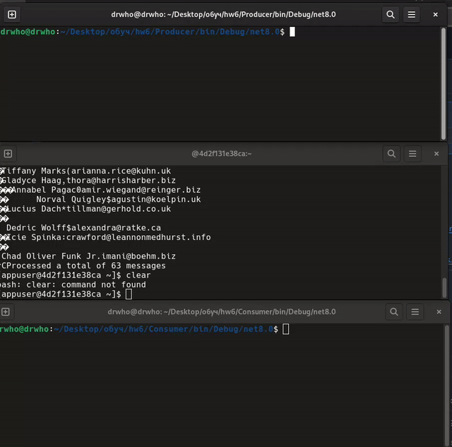

## **Продюсер.**
(ссылка на сервис Consumer [https://github.com/MkhlLis/MonitoringService/tree/master](https://github.com/MkhlLis/Consumer/tree/master))

Взаимодействие между МС -- асинхронное через Apache Kafka


Интерфейсы связаны с реализациями посредством DI (Startup.cs).
```
services.AddHostedService<Worker>();
services.ConfigureKafka(configuration);
services.AddSingleton<IMessageProducer, MessageProducer>();
```

**1. Сервис реализует MVP отправки сообщений в  Kafka**
Особенности:
1. Использован Confluent.Kafka.DependencyInjection, конфгурация продюсера реализована через appsettings.json:
```
"Kafka": {
    "BootstrapServers": "localhost:9092"
  }
```
```
services.Configure<ProducerConfig>(configuration.GetSection("Kafka"));
services.AddKafkaClient();
```
2. HostedService Worker каждые 10 секунд передает сообщения на отправку
```
protected override async Task ExecuteAsync(CancellationToken stoppingToken)
    {
        while (!stoppingToken.IsCancellationRequested)
        {
            if (_logger.IsEnabled(LogLevel.Information))
            {
                _logger.LogInformation("Worker running at: {time}", DateTimeOffset.Now);
            }

            await _producer.SendAsync(new User
            {
                id = Faker.RandomNumber.Next(10000, 99999),
                name = Faker.Name.FullName(),
                email = Faker.Internet.Email(),
            });

            await Task.Delay(10000, stoppingToken);
        }
    }
```
3. MessageProducer десериализирует (Avro) и отправляет сообщение (реализующее интерфейс ISpecificRecord)
```
    public async Task SendAsync<T>(T message) where T : ISpecificRecord
    {
        try
        {
            // Сериализация объекта User в байты с помощью Avro
            byte[] avroData;
            using (var ms = new MemoryStream())
            {
                var writer = new BinaryEncoder(ms);
                var datumWriter = new SpecificDatumWriter<T>(message.Schema);
                datumWriter.Write(message, writer);
                avroData = ms.ToArray();
            }
            
            var result = await _producer.ProduceAsync("test-topic", new Message<Null, byte[]> { Value = avroData });
            Console.WriteLine($"Message '{result.Value}' " +
                              $"sent to '{result.TopicPartitionOffset.Topic}', " +
                              $"offset is {result.TopicPartitionOffset.Offset}");
            
            
        }
        catch (ProduceException<Null, string> e)
        {
            Console.WriteLine($"Failed to send message: {e.Error.Reason}");
        }
    }
```
   


TODO: Inbox, Outbox используя например KafkaFlow. 
